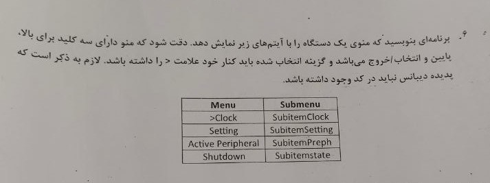

# **🧠 STM32 Menu Design Program Project | پروژه طراحی برنامه‌ی منو با STM32**

**A university project where a menu program was designed with STM32F407VG that works with keys and a 2x16 LCD.**

**یک پروژه دانشگاهی که در آن یک برنامه‌ی منو با STM32F407VG طراحی شده است که با کلیدها و LCD 2x16 کار میکند.**

# 💬 **نکات پروژه**

* برای اجرا برنامه، به STM32F407VG نیاز دارید.
* برای دسترسی به همه‌ی پروژه‌های دانشگاهی من، به این لینک مراجعه کنید:

👈🏻 **[پروژه‌های دانشگاهی من](https://github.com/bestmahdi2/Uni__Bachelors_SKU_Path)**

# 📝 **توضیحات پروژه**

